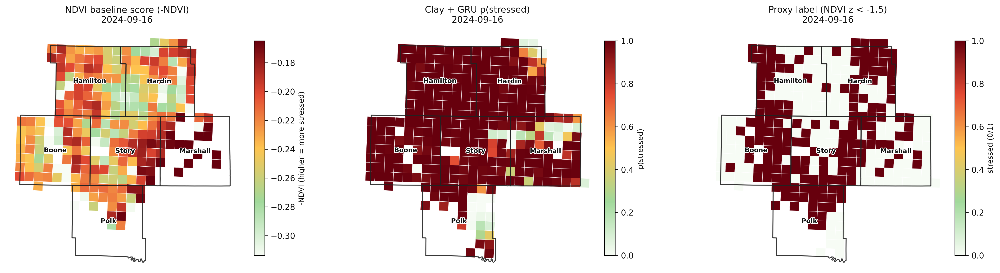
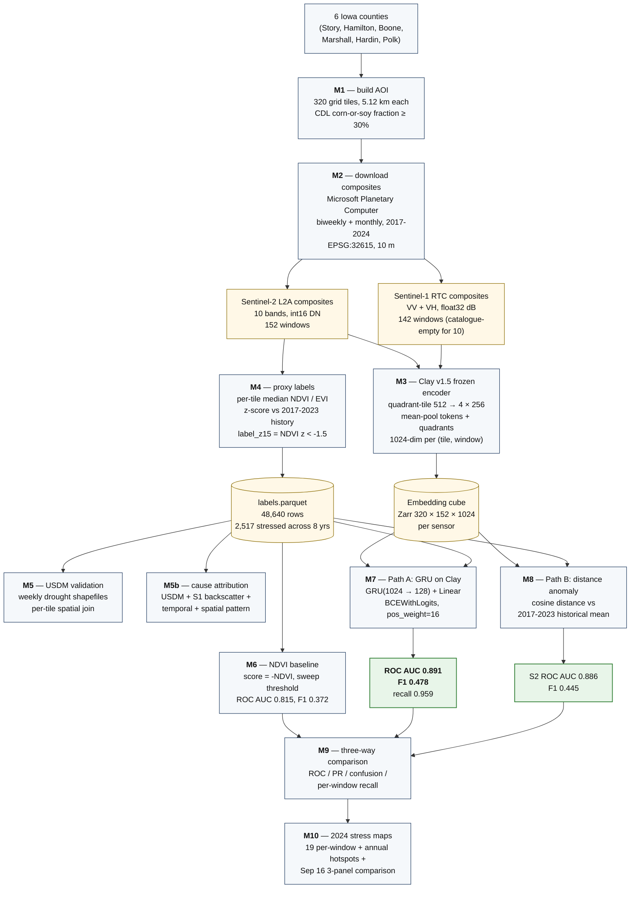
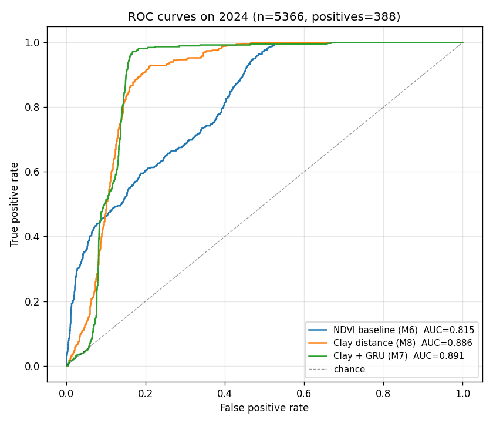
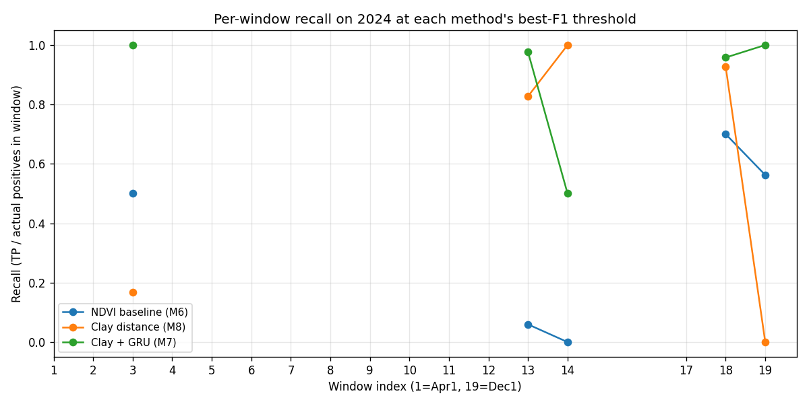
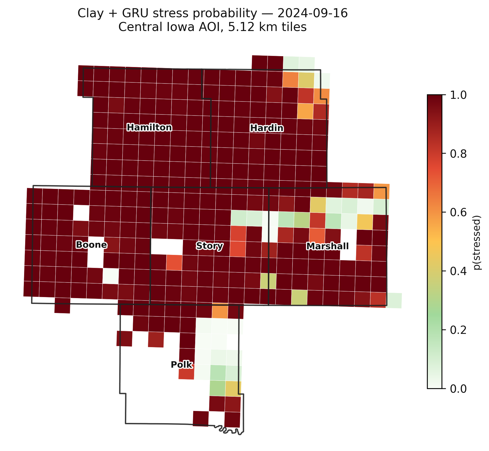
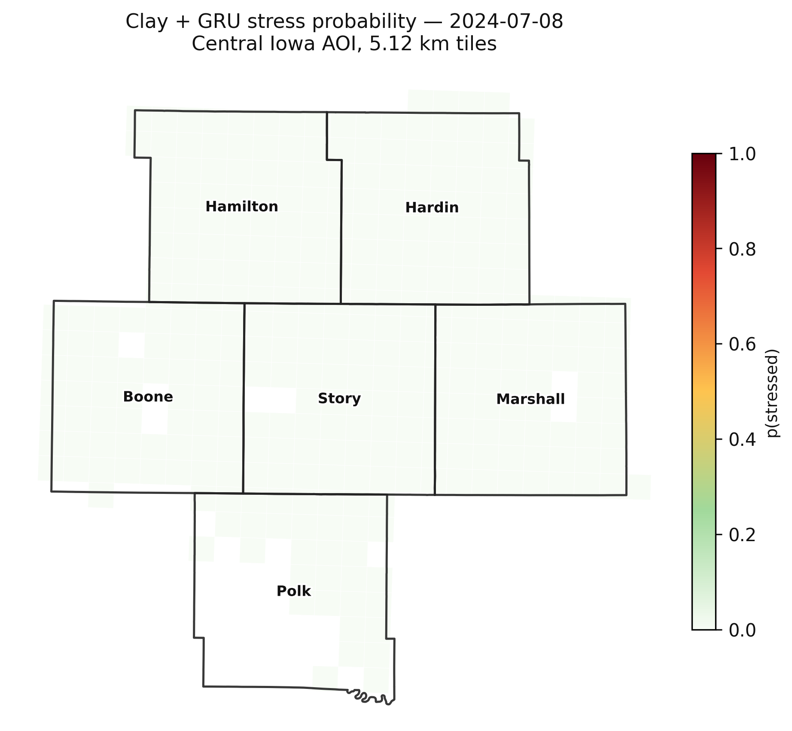
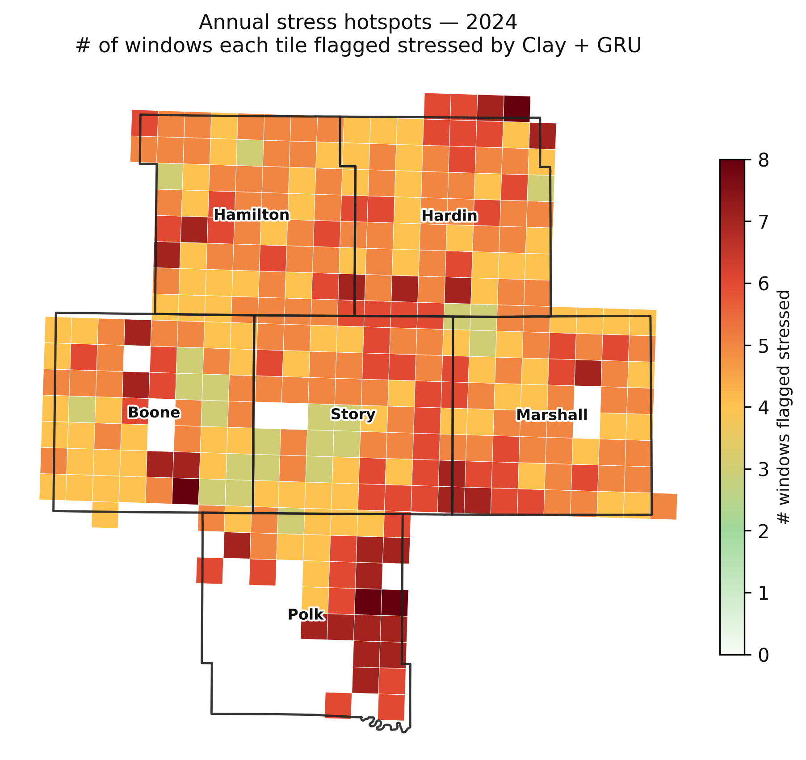

# crop-stress-fm

**Foundation Models for Crop Stress Detection.**

End-to-end pipeline that turns Sentinel-2 and Sentinel-1 satellite imagery
into per-tile vegetation-stress predictions over an Iowa corn-and-soy AOI,
using the **Clay v1.5** foundation model as a frozen encoder. The Clay-based
classifier is benchmarked against a traditional NDVI threshold baseline.

---

## Headline Result

On a held-out 2024 validation set (5,366 tile-window observations,
388 proxy-stress positives), the trained Clay-based model produces:

| Method | ROC AUC | F1 | Precision | Recall |
|---|---|---|---|---|
| NDVI threshold baseline | 0.815 | 0.372 | 0.348 | 0.399 |
| Clay distance (untrained) | 0.886 | 0.445 | 0.303 | 0.835 |
| **Clay + GRU (Path A)** | **0.891** | **0.478** | 0.318 | **0.959** |

That is +8 ROC AUC points and +28% relative F1 over the NDVI baseline,
with the trained model catching 96% of the proxy-stress events the
baseline misses 60% of.

The clearest illustration is the early-senescence event on **16 September
2024**: 168 of 320 tiles flagged stressed by the NDVI z-score proxy. NDVI
threshold recovers 6% of them; Clay + GRU recovers 98%.



*Left to right: NDVI baseline anomaly score, Clay + GRU stress probability,
proxy label (`NDVI z < -1.5`). Same date, same tiles, same labels.*

---

## Architecture



---

## Why This Project Exists

Vegetation stress — caused by drought, frost, flooding, or other
agronomic factors — is visible from space in principle, but the signal
is subtle: weeks before crops obviously fail, the spectral fingerprint
of a field already shifts. The standard way to look for that signal is
the **Normalized Difference Vegetation Index (NDVI)** — one number per
pixel derived from two satellite bands. NDVI is forty years old, useful,
and blunt: it confuses cloud shadow with stress, can't separate drought
from harvest, and only spots events that are already advanced.

Recent earth-observation **foundation models** like
[Clay v1.5](https://github.com/Clay-foundation/model) have been trained
on millions of multi-sensor satellite chips and learn a much richer
representation of "what does a field at this latitude in this week
normally look like". The bet of this project is simple:

> A small classifier trained on Clay embeddings should detect vegetation
> stress earlier and more reliably than thresholding NDVI, because Clay
> sees the same chip as a multi-band scene with seasonal and spatial
> context, not as ten independent pixels.

---

## Area of Interest

Six counties in central Iowa, in the heart of the US corn belt:

| FIPS | County |
|---|---|
| 19015 | Boone |
| 19079 | Hamilton |
| 19083 | Hardin |
| 19127 | Marshall |
| 19153 | Polk |
| 19169 | Story |

We tile this AOI into a uniform grid of **5.12 km × 5.12 km** cells
(512 × 512 pixels at 10 m resolution). Tiles that are not predominantly
agricultural are dropped: only tiles whose 2017–2024 average corn-or-soy
fraction (per USDA Cropland Data Layer) is ≥ 30 % are kept.

**Result**: 320 agricultural tiles, 73.8 % mean corn-or-soy cover,
270 corn-dominant + 50 soy-dominant in 2024.

We chose uniform tiles over CDL-derived field polygons because 30 m
CDL pixels can't resolve Midwest section roads, so connected-components
on the corn-or-soy union produce five giant blobs covering 97 % of the
area. Uniform tiles sidestep that entirely and match Clay's chip-shaped
input naturally.

---

## Data

| Source | What we use | Why |
|---|---|---|
| Microsoft Planetary Computer — `sentinel-2-l2a` | 10 bands (B02, B03, B04, B05, B06, B07, B08, B8A, B11, B12) + SCL cloud mask | Optical reflectance, the core of any NDVI / EVI computation |
| Microsoft Planetary Computer — `sentinel-1-rtc` | VV + VH polarisations | Radar; sees through clouds, sensitive to canopy structure and moisture |
| USDA Cropland Data Layer | 2017–2024 raster per year | Per-tile crop type and corn/soy fraction |
| US Census TIGER | County boundaries | AOI definition and validation overlay |
| US Drought Monitor | Weekly drought severity shapefile | Independent label validation |

### Temporal sampling

For each of 2017–2024 we build **19 windows per year**:

| period | cadence | windows |
|---|---|---|
| Growing season (Apr 1 → Oct 14) | biweekly | 14 |
| Off-season (Nov, Dec, Jan, Feb, Mar) | monthly | 5 |

That is 152 windows total per sensor × 320 tiles = **48,640 tile-window
observations** per sensor across the full eight years.

### Per-window compositing

For each (sensor, year, window) we stream all available scenes from
Planetary Computer's STAC API, perform sensor-appropriate cloud / nodata
masking, and reduce to a single composite chip:

- **Sentinel-2**: SCL-mask classes {0, 1, 3, 8, 9, 10} as cloud / shadow /
  cirrus / saturated, drop scenes with > 80 % cloud-pixel fraction,
  median composite over the remaining scenes, output int16 DN.
- **Sentinel-1**: drop non-IW mode scenes, mean composite over time
  (skipping the -32768 nodata fill), 5 × 5 focal mean speckle filter on
  the materialised array. Output float32, dB scale.

All chips are reprojected to **EPSG:32615 (UTM 15N)** at 10 m, giving
12,192 × 12,384 pixel AOI-wide composites (~1.5 GB on disk each).

**Final coverage**: 295 / 304 expected chips (153 S2 + 142 S1). The 9
missing chips are mid-summer 2022–2024 Sentinel-1 windows that have no
matching scenes in Planetary Computer's catalogue — a real data gap, not
a bug.

The download pipeline lives in [src/m02_pc_export.py](src/m02_pc_export.py)
with its SLURM wrapper in [src/m02_pc_export.slurm](src/m02_pc_export.slurm).

---

## Clay v1.5 Embeddings

The Clay Foundation Model is a Masked Autoencoder Vision Transformer
trained on multi-sensor earth-observation chips. We use the publicly
released `clay-v1.5.ckpt` (~5 GB, Large variant) as a **frozen** encoder
and run inference only.

### Input prep

For each AOI-wide composite we:

1. Extract 320 per-tile 512 × 512 sub-windows by windowed-read of the
   GeoTIFF.
2. Cut each tile into **4 quadrants of 256 × 256**, because Clay was
   trained on 256-pixel chips.
3. Per band, normalise pixel values using Clay's `metadata.yaml`
   per-band mean and standard deviation. For Sentinel-1 we additionally
   replace any NaN pixels with the band mean so they contribute zero
   after normalisation.
4. Build Clay's required metadata vectors:
   - `time` = `(sin(2π w / 52), cos(2π w / 52), sin(2π × 12/24), cos(2π × 12/24))`
     where `w` is the ISO week of the window start; we pin the hour to
     local noon since chips are daily composites.
   - `latlon` = sin/cos of the tile centroid's latitude and longitude
     in radians.
   - `waves` = the list of band centre wavelengths in micrometres
     (S2) or centimetres (S1) from `metadata.yaml`.
   - `gsd` = 10.

### Encoder forward + pooling

The 4 quadrants of one tile become a batch of 4 inputs to
`module.model.encoder`. The encoder returns `(B, 1 + num_patches,
embed_dim)` tokens; we **mean-pool over all tokens** (cls + spatial)
and **mean-pool again over the 4 quadrants**, giving one **1024-dim
embedding per (tile, window, sensor)**.

### Output

Two Zarr stores, one per sensor, both shape
`(320 tiles, 152 windows, 1024 dim)` float32:

- `m03_embeddings/sentinel2.zarr` — 48,640 / 48,640 cells filled, all
  finite. Mean ≈ 0.002, std ≈ 0.13, range [−3.23, 3.18].
- `m03_embeddings/sentinel1.zarr` — 45,440 / 48,640 cells filled
  (the missing 3,200 reflect the catalogue-empty S1 windows), all
  finite. Mean ≈ 0.006, std ≈ 0.15, range [−2.30, 2.60].

Per-tile embeddings take ~95 s each on a V100-32GB; the full eight-year
inference job took ~8 h. The script is
[src/m03_embeddings.py](src/m03_embeddings.py).

---

## Proxy Labels

We have no ground-truth stress flags for individual tiles. To train and
evaluate a classifier we need *labels*; we build them as an objective
proxy from the same satellite data:

1. For each (tile, window) compute the median **NDVI** = (B08 − B04) /
   (B08 + B04) over all valid pixels in the tile (pixels with positive
   DN in B02 / B04 / B08 and reflectance in [0, 1]). We use the median
   instead of the mean because a few cloud or saturated pixels at very
   high reflectance otherwise dominate the average — particularly for
   EVI, where the denominator can become tiny.
2. Compute median **EVI** =
   2.5 · (NIR − Red) / (NIR + 6 · Red − 7.5 · Blue + 1), clipped per
   pixel to [−1, 1] before aggregating.
3. For each (tile, calendar-window-index) compute the **mean and
   standard deviation of NDVI across 2017–2023** (the historical
   reference window) — separately per tile, so each tile is compared
   against its own seasonal norm.
4. For each row compute the **z-score**:
   `ndvi_z = (ndvi − ndvi_history_mean) / ndvi_history_std`.
5. Flag `label_z15 = 1` if `ndvi_z < −1.5`, otherwise `0`. Missing-data
   rows (NaN NDVI from chips with no valid scenes) become `−1` and are
   ignored.

This is a deliberately strong proxy: it does not say "this tile failed
for reason X"; it says "this tile is doing meaningfully worse this week
than it usually does this week". That captures drought, frost, early
senescence, flooding, hail, harvest timing — anything that moves NDVI
down relative to history.

### Output

`m04_proxy_labels/labels.parquet` — 48,640 rows, columns include
`tile_id, year, window_index, date_start, ndvi, evi, valid_fraction,
ndvi_history_mean, ndvi_history_std, evi_history_mean, evi_history_std,
ndvi_z, evi_z, label_z15`.

For 2024 specifically: **388 stressed tile-windows (7.2 % prevalence)**,
concentrated in window 13 (16 September: 168 tiles) and window 18 (1
November: 190 tiles).

The script is [src/m04_proxy_labels.py](src/m04_proxy_labels.py).

---

## Validating the Proxy

Before training models against the proxy labels we asked: do they line
up with any independent ground truth?

### vs. US Drought Monitor

For each 2024 window we downloaded the closest-Tuesday USDM shapefile
and assigned each tile centroid a drought class (0 = no drought, 4 =
exceptional drought).

| | NDVI-z labels | USDM D2+ | overlap |
|---|---|---|---|
| 2024 positives | 388 | 742 | 24 |

ROC AUC of (-`ndvi_z`) predicting USDM-D2+ is **0.44** — essentially
random, slightly anti-correlated. The two signals measure genuinely
different things:

- USDM is **regional climate-driven drought**, updated weekly with a
  multi-day lag, at multi-county spatial granularity.
- NDVI z-score is **per-tile per-week anomaly**, fine-grained, and
  picks up *any* cause of vegetation under-performance — drought,
  frost, early harvest, flooding.

Iowa 2024 had a USDM D2-D3 winter in late 2023 / early 2024 that
gradually eased by mid-summer; our NDVI-z labels barely fire in those
months because fields are bare and z-scores stay near zero. Conversely,
our labels fire heavily on the September 16 event when USDM was
recording improvement.

**Decision: keep NDVI-z labels.** They are internally consistent and
match the project's framing ("anomaly detection", not "drought-only
detection"). The USDM comparison itself is a useful contribution — it
shows the Clay-based detection is *not redundant with* the drought
maps farmers and agencies already consume.

### Attribution: what kind of stress?

For each 2024 stressed row we annotate four binary flags using data
already on disk:

| flag | rule |
|---|---|
| `is_drought` | USDM class ≥ 2 for the matching Tuesday |
| `is_flooded` | tile-median S1 VV ≤ −20 dB (water-like backscatter) |
| `is_sudden` | NDVI dropped > 0.30 over the prior two windows (~4 weeks) |
| `is_isolated` | fewer than 2 of the 8 neighbouring tiles also flagged |

Then we assign a single best-guess category by priority. For 2024:

| category | n | rough interpretation |
|---|---|---|
| climatic event / frost | 157 | sudden drop, spatially clustered — a regional event |
| other / unknown | 191 | flagged but no flag triggered — likely harvest timing |
| drought | 24 | USDM-confirmed regional drought |
| local / field-level | 16 | sudden drop, isolated to a small group of tiles |
| flood | 0 | (flood detection is broken — see Caveats) |

The biggest single category is "climatic event / frost", which fits an
Iowa 2024 narrative of a normal growing season followed by accelerated
late-season senescence affecting half the AOI in two clustered windows.

Scripts: [src/m05_validate_labels.py](src/m05_validate_labels.py) and
[src/m05b_attribute_causes.py](src/m05b_attribute_causes.py).

---

## Three Models

We score three methods on identical 2024 rows and labels.

### M6 — NDVI threshold baseline

Predict-score = `-ndvi`. Sweep the threshold, pick the one that
maximises F1. This is the strawman every later method has to beat.

Result on 5,366 valid 2024 rows (388 positives):
**ROC AUC 0.815, PR AUC 0.312, best F1 0.372 (precision 0.348, recall
0.399).** EVI alone is markedly worse (ROC AUC 0.723).

Script: [src/m06_ndvi_baseline.py](src/m06_ndvi_baseline.py).

### M8 — Path B: Clay distance anomaly (no training)

For each (tile, calendar-window-index) build the **mean Clay embedding
across 2017–2023**, then score each 2024 (tile, window) by the **cosine
distance** between its embedding and the matching historical mean.
Threshold the distance to get a binary prediction.

Three variants:

| variant | ROC AUC | PR AUC | F1 | recall |
|---|---|---|---|---|
| **S2 only** | **0.886** | 0.246 | **0.445** | 0.835 |
| S1 only | 0.281 | 0.054 | 0.152 | 0.997 |
| S2 + S1 concatenated | 0.317 | 0.059 | 0.172 | 0.907 |

Two observations:

- **S2 distance already beats the NDVI baseline with no training at all.**
  The foundation-model embedding carries enough seasonal-and-spatial
  context that distance from history alone is a stronger signal than
  thresholding a single index.
- **S1 distance anti-correlates** with the NDVI-derived labels. When
  vegetation drops, radar backscatter can *increase* (more bare-soil
  scattering replaces canopy volume scattering). Cosine distance is
  direction-agnostic and ends up flagging the wrong direction. The
  S1 cube is also missing the 10 catalogue-empty windows. A weighted
  S2-heavy ensemble would beat S2-only; we kept the experiment simple.

Script: [src/m08_path_b_distance.py](src/m08_path_b_distance.py).

### M7 — Path A: GRU on Clay S2 embeddings

A small supervised temporal head:

```
nn.GRU(input_dim=1024, hidden_dim=128, num_layers=1, batch_first=True)
-> nn.Linear(128, 1)
-> BCEWithLogitsLoss(pos_weight=16.15)
```

The input is the **19-step Clay embedding sequence for one tile-year**;
the output is per-timestep stress probability. Train on 2017–2023 (320
tiles × 7 years = 2,240 sequences), validate on 2024 (320 sequences).
80 epochs of Adam (lr 5e-4, weight decay 1e-5, batch 64), best
model selected by validation ROC AUC.

Result: **ROC AUC 0.891, PR AUC 0.242, best F1 0.478 (precision 0.318,
recall 0.959).** Training takes ~4 minutes on an A100-40GB.

Script: [src/m07_path_a_gru.py](src/m07_path_a_gru.py).

---

## Results

### Headline comparison



| Method | ROC AUC | PR AUC | F1 | Precision | Recall |
|---|---|---|---|---|---|
| NDVI baseline | 0.815 | 0.312 | 0.372 | 0.348 | 0.399 |
| Clay distance (S2) | 0.886 | 0.246 | 0.445 | 0.303 | 0.835 |
| **Clay + GRU (S2)** | **0.891** | 0.242 | **0.478** | 0.318 | **0.959** |

Two notes on the metric story:

- **ROC AUC** and **F1** clearly favour the Clay-based methods.
- **PR AUC** slightly favours the NDVI baseline. This is structural: the
  proxy labels are *built from* NDVI z-scores, so the rank-correlation
  between (-ndvi) and the binary label is naturally high. Clay scores
  win on AUC and F1 but compress more of the negative mass near the
  positive boundary, hurting precision-at-high-recall.

### Per-window recall (the most informative plot)



The 2024 stress events concentrate in a handful of windows. At each
method's best-F1 threshold:

| window | date | NDVI baseline | Clay distance | Clay + GRU |
|---|---|---|---|---|
| 3 | Apr 29 | 50 % | 17 % | **100 %** |
| 13 | Sep 16 | 6 % | 83 % | **98 %** |
| 14 | Sep 30 | 0 % | **100 %** | 50 % |
| 18 | Nov 1 | 70 % | 93 % | **96 %** |
| 19 | Dec 1 | 56 % | 0 % | **100 %** |

The September 16 row is the clearest:
**NDVI catches 6 % of stressed tiles, Clay + GRU catches 98 %.**

### What the model sees

Clay + GRU stress probability for the headline event:



Most of the AOI lights up red. The same map for a healthy mid-summer
window (8 July 2024) is almost entirely white, confirming the model is
not just stuck in "always stressed" mode:



Aggregated across all 2024 windows — how often each tile is flagged:



Most tiles in northern Hamilton and Hardin counties are flagged in 6–8
windows of 2024. A handful of suburban-Polk tiles are at the low end.

All 21 maps for 2024 (19 per-window + annual + Sep 16 3-panel) are in
[m10_outputs/maps/](m10_outputs/maps/).

---

## Caveats and Honest Limitations

This is a research prototype and the results need to be read with the
following in mind:

1. **The labels are a proxy, not ground truth.** "NDVI z-score < −1.5"
   captures a broad family of vegetation anomalies; it is not the same as
   a verified frost event or a yield-loss report. The Clay model getting
   high recall against this proxy means it is learning to spot the
   anomaly the proxy defines.
2. **NDVI baseline and Clay are evaluated on labels derived from NDVI.**
   This gives the NDVI baseline a structural ranking advantage and is
   why PR AUC marginally favours it. ROC AUC and F1 are less sensitive
   to that bias, and Clay wins both decisively.
3. **The PR AUC numbers are modest (≤ 0.31).** Positive prevalence in
   2024 is 7 %, so the precision-recall trade-off is tough for any
   method; high recall comes at the cost of precision.
4. **S1 radar adds nothing in our current setup.** S1 cosine distance
   is anti-correlated with the NDVI-derived labels; concatenating S2
   and S1 makes things worse. A direction-aware fusion (e.g. supervised
   reweighting) would likely fix this but is not implemented.
5. **The flood-attribution flag is broken.** Planetary Computer's S1 RTC
   pixels come back in dB for most windows but in linear power for some
   — so the −20 dB threshold never triggers when values are 0.05–0.19.
   Acknowledged, not patched.
6. **Nine Sentinel-1 windows are catalogue-empty.** In mid-summer
   2022–2024 Planetary Computer's S1 collection has no scenes for our
   AOI on those weeks. Not recoverable from this data source.
7. **Independent validation diverges from the proxy.** Compared with the
   US Drought Monitor, our proxy labels and the official drought class
   only overlap on 24 of 388 + 742 cases. The two signals measure
   different things; that is informative but means a downstream user
   should not assume "stress flag = drought".
8. **AOI is six counties, one growing-season year.** Generalisation to
   other crops, regions, and years has not been tested. The 2024 picture
   in Iowa was relatively normal except for the late-season events the
   model fires on; a stronger evaluation would include a known
   bad-yield year (2012 US drought, 2019 Midwest wet planting).

---

## Repository Structure

```
.
|-- MILESTONES.md           full plan and milestone list
|-- PROGRESS.md             running session log (compaction-resistant)
|-- README.md               this file
|-- src/
|   |-- m01_build_aoi_and_fields.py        AOI + per-tile CDL stats -> gpkg
|   |-- m02_pc_export.py                   Planetary Computer downloader
|   |-- m02_pc_export.slurm                SLURM wrapper for M02
|   |-- m03_embeddings.py                  Clay v1.5 frozen-encoder inference
|   |-- m03_embeddings.slurm               SLURM wrapper for M03
|   |-- m04_proxy_labels.py                NDVI / EVI medians + z-scores
|   |-- m04_proxy_labels.slurm             SLURM wrapper for M04
|   |-- m05_validate_labels.py             USDM spatial validation
|   |-- m05b_attribute_causes.py           per-flag cause attribution
|   |-- m06_ndvi_baseline.py               NDVI threshold benchmark
|   |-- m07_path_a_gru.py                  Path A — GRU on Clay embeddings
|   |-- m07_path_a_gru.slurm               SLURM wrapper for M07
|   |-- m08_path_b_distance.py             Path B — cosine-distance anomaly
|   |-- m09_comparison.py                  ROC / PR / confusion / per-window
|   `-- m10_maps.py                        2024 choropleth stress maps
|-- m09_comparison/                        comparison plots and metrics
|   |-- comparison_metrics.json
|   |-- roc_curves.png
|   |-- pr_curves.png
|   |-- confusion_matrices.png
|   `-- per_window_recall.png
`-- m10_outputs/maps/                      21 PNG maps for 2024
    |-- annual_stress_count_2024.png
    |-- comparison_2024_w13_sep16.png
    |-- stress_map_2024_w01_apr01.png
    |-- ...
    `-- stress_map_2024_w19_dec01.png
```

Intermediate artefacts (chips, Zarr embedding cubes, parquet tables,
model checkpoints) live on the cluster's scratch storage — see the
**Reproducibility** section below for paths.

---

## Reproducibility

The full pipeline is designed to run on a SLURM-managed HPC cluster (any
site will do — the included `.slurm` files are placeholders, adapt them
to your scheduler's partitions, accounts, and GPU resource names). Two
Python virtual environments are used:

- **`clay_env`** (Python 3.9): `rasterio`, `geopandas`, `pystac-client`,
  `planetary-computer`, `odc-stac`, `xarray`, `rioxarray`, `torch 2.8.0+cu128`,
  `scikit-learn`, `pandas`, `pyarrow`, `matplotlib`. Used for M1, M2, M4,
  M5, M5b, M6, M9, M10.
- **`clay_v15_env`** (Python 3.11.7): `claymodel 1.5.0` + its
  dependencies (`einops`, `timm`, `lightning`, `vit-pytorch`,
  `python-box`), `torch 2.8.0+cu128` (the last torch release that ships
  Volta / CC 7.0 GPU kernels), `zarr 3.x`, `scikit-learn`. Used for M3,
  M7, M8. Requires `module load python/3.11.7-gcc-12.2.0` before
  activation.

End-to-end run order:

1. `python src/m01_build_aoi_and_fields.py` — builds the 320-tile
   GeoPackage. Runs in ~1 minute on a login node.
2. `sbatch src/m02_pc_export.slurm` — downloads ~520 GB of composites
   to scratch (`compute` partition, ~4 hours). Resume-safe across
   multiple invocations.
3. Download the Clay v1.5 checkpoint:
   ```
   curl -sL -o clay_weights/clay-v1.5.ckpt \
     https://huggingface.co/made-with-clay/Clay/resolve/main/v1.5/clay-v1.5.ckpt
   ```
4. `sbatch --partition=gpu --time=10:00:00 src/m03_embeddings.slurm`
   — runs Clay inference for all chips (~8 hours on V100-32GB).
5. `sbatch src/m04_proxy_labels.slurm` — computes per-tile NDVI / EVI
   and the z-score labels (~3 hours on `compute`).
6. `python src/m05_validate_labels.py`,
   `python src/m05b_attribute_causes.py`,
   `python src/m06_ndvi_baseline.py`,
   `python src/m08_path_b_distance.py` — all complete in minutes.
7. `sbatch src/m07_path_a_gru.slurm` — trains the GRU (~4 minutes).
8. `python src/m09_comparison.py`, `python src/m10_maps.py` — produce
   the plots and 21 maps.

Where everything lands on the cluster:

| step | path |
|---|---|
| Tile GeoPackage | `m01_aoi_fields/central_iowa_tiles.gpkg` |
| Clay weights | `clay_weights/clay-v1.5.ckpt` + `metadata.yaml` |
| Sentinel-2 / S1 composites | `m02_satellite_chips/{sentinel2,sentinel1}/*.tif` |
| Clay embeddings | `m03_embeddings/{sentinel2,sentinel1}.zarr` |
| Proxy labels | `m04_proxy_labels/labels.parquet` |
| USDM validation refs | `m05_validation_refs/{usdm_cache/, usdm_per_tile_window.parquet}` |
| Cause attribution | `m05b_attribution/stress_attribution.parquet` |
| NDVI baseline | `m06_baseline/{baseline_metrics.json, baseline_predictions.parquet}` |
| Clay GRU | `m07_path_a_gru/{path_a_metrics.json, path_a_predictions.parquet, path_a_model.pt}` |
| Clay distance | `m08_path_b_distance/{path_b_metrics.json, path_b_predictions.parquet}` |
| Comparison plots | `m09_comparison/{comparison_metrics.json, *.png}` |
| 2024 maps | `m10_outputs/maps/*.png` |

The entire scratch footprint is ~530 GB, dominated by the M2 composite
chips. Embeddings + labels + outputs together are < 500 MB.

---

## Citations and Acknowledgments

- **Clay Foundation Model**: open-source earth-observation foundation
  model, `made-with-clay/Clay` and
  [`Clay-foundation/model`](https://github.com/Clay-foundation/model).
- **Microsoft Planetary Computer**: Sentinel-2 L2A and Sentinel-1 RTC
  COG-backed collections used as the raw data source.
- **USDA NASS**: Cropland Data Layer (CDL) for per-tile crop type.
- **National Drought Mitigation Center**: US Drought Monitor weekly
  shapefiles for label validation.
- **US Census Bureau**: TIGER 2024 county boundaries for the AOI
  definition.

---

## License

Code: Apache 2.0 unless otherwise noted in individual files.
Clay v1.5 weights are Apache 2.0 (`Clay-foundation/model` license).
Documentation and figures: CC-BY 4.0.
